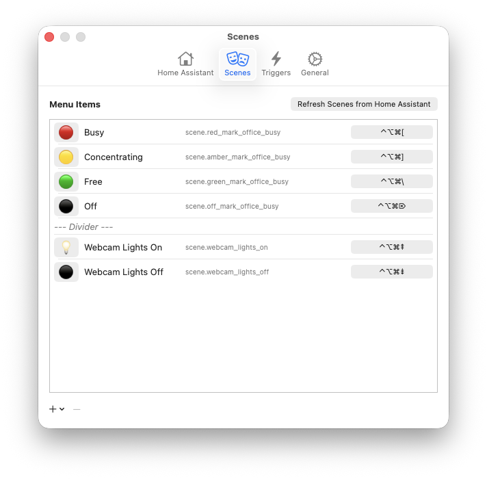
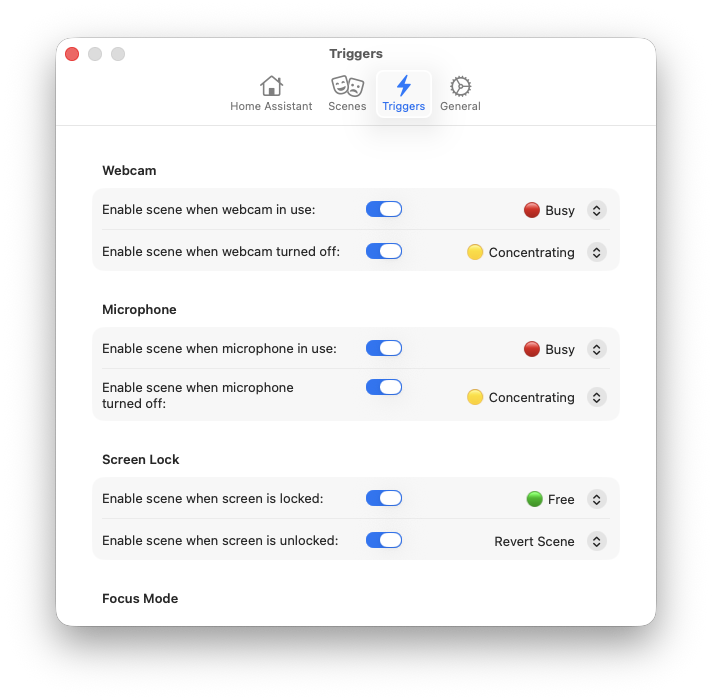
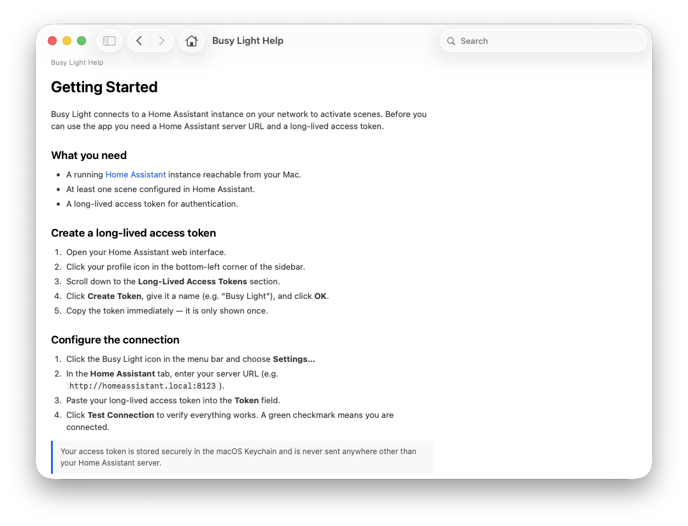

# Busy Light Controller for macOS

A macOS menu bar application that connects to [Home Assistant](https://www.home-assistant.io) to trigger scenes, designed for controlling a "busy light" outside a room to indicate whether you may be disturbed.


_However,_ you can use it to trigger _any_ scene set up in HA, so the possibilities are quite unlimited!

> [!TIP]
>
> #### Busy Light Hardware
>
> Documented [here](./Hardware/Busy%20Light%20Hardware.md), the one that I built is bacically some WS2812 LEDs connected to an ESP32 controller and set up with ESPHome using the [ESP32 RMT LED Strip component](https://esphome.io/components/light/esp32_rmt_led_strip/). This clips over a door, powered by a USB battery pack, in a 3D-printed enclosure.

You can use it for anything you have a **Scene** set up for in Home Assistant: an RGB light bulb, a power switch for some other light, or it doesn't even have to be a light at all.

> [!NOTE] I am a human deveoper, but this project was a trial run for working with Claude Code on a project. I designed it, asked Claude to do have a go at some features, sometimes re-wrote it myself, and sometimes had Claude take a shot at rewriting it until it was right. It's a silly little menu bar item, and I've been using it for over a month with only [one little bug](https://github.com/swizzlevixen/busylight/issues/2), but just wanted to mention it, in case an LLM touching it makes a difference to you.

## Screenshots





## Features

### Menu Bar

- Displays the most recently triggered scene (emoji, name, or both) in the macOS menu bar
- Click to see your list of configured scenes and switch between them
- **Help,** **Settings…,** and **Quit Busy Light** are always available at the bottom of the menu

### Home Assistant Integration

- Connect to any Home Assistant instance via its REST API
- Automatically fetch available scenes and configure which ones appear in the menu
- Customize each scene with an emoji (via the system emoji picker) and a display name
- Scenes can be reordered and separated with dividers
- Add and remove scenes and dividers using +/- buttons
- HA connection resilience with automatic retry and health monitoring
- Scenes automatically refresh when opening the Scenes settings tab

### Automatic Triggers

- **Webcam detection** -- Automatically trigger a scene when your camera turns on or off (great for video calls)
- **Microphone detection** -- Trigger scenes for audio-only calls
- **Screen lock/unlock** -- Change scenes when you lock your screen or step away
- **Focus mode** -- React to macOS Focus/Do Not Disturb activation (experimental)
- **Revert Scene** -- For any "off" trigger (webcam off, mic off, screen unlocked, focus deactivated), choose "Revert Scene" to automatically return to whatever scene was active before the trigger fired

### Automation

- **Keyboard shortcuts** -- Assign global hotkeys to any scene directly in the Scenes settings tab
- **AppleScript** -- Full scripting support for integration with other apps and workflows
- **Shortcuts.app** -- Native Shortcuts actions for modern automation

> [!CAUTION]
> AppleScript and Shortcuts support is experimental and a work in progress. Something missing or broken? Please file a bug!

### Other

- First-run welcome dialog guides you through initial setup
- Help in Help Book format
- Launch at login support
- Secure HA token storage in macOS Keychain
- No dock icon (runs purely in the menu bar)
- Undo/Redo support in Scenes settings tab
- Usage information in standard macOS Help menu
- ❤️ Tip/donation button in General settings tab, if you feel so moved

## Requirements

- macOS 14.0 (Sonoma) or later
- A Home Assistant instance with a Long-Lived Access Token
- A [Home Assistant scene](https://www.home-assistant.io/integrations/scene/) configured for your busy light

## Installation

### Download

Download [the latest release of the signed app](https://github.com/swizzlevixen/busylight/releases/latest) from the releases tab in this repo, ready to use.

### Build from Source

1. Clone the repository: [TK NOT CORRECT URL]

   ```bash
   git clone https://github.com/mboszko/busylight.git
   cd busylight
   ```

2. Generate the Xcode project:

   ```bash
   brew install xcodegen  # if not already installed
   xcodegen generate
   ```

3. Build and run:

   ```bash
   xcodebuild -project BusyLight.xcodeproj -scheme BusyLight build
   ```

   Or open `BusyLight.xcodeproj` in Xcode and press Run.

4. The app will appear in your menu bar (no dock icon).

## Setup

1. **First Run**: On first launch, a welcome dialog will guide you to configure your Home Assistant connection. Click "Open Settings" to get started.

2. **Connect to Home Assistant**: In the Home Assistant tab, enter your HA URL and Long-Lived Access Token, then click "Test Connection". Help text below the token field explains how to create a token. A common default URL is pre-filled for convenience.

> [!NOTE]
> Busy Light will ask you to unlock you Keychain to save and retrieve the API key for Home Assistant.
> 
> It will also ask you to allow it to find devices on local networks, which is needed to contact Home Assistant.

3. **Add Scenes**: Go to the Scenes tab. Available scenes are automatically fetched from Home Assistant. Use the **➕** button to add scenes from the popup menu, or add a divider to organize your list. Use the **➖** button to remove a selected scene or divider. Customize each scene's emoji (click to open the system emoji picker) and display name. Assign optional keyboard shortcuts directly in each scene row.

4. **Configure Triggers** (optional): Go to the Triggers tab to set up automatic scene activation based on webcam, microphone, screen lock, or Focus mode. For "off" triggers, you can select "Revert Scene" to automatically switch back to whatever scene was active before the trigger fired.

5. **Set Display Preferences**: In the General tab, choose how scenes appear in the menu bar (emoji only, name only, or both) and enable launch at login.

## AppleScript

```applescript
tell application "Busy Light"
    -- Activate a scene
    activate scene "scene.office_busy"

    -- Check current state
    get current scene        -- returns entity ID or ""
    get is busy              -- returns true/false
    get camera active        -- returns true/false
    get microphone active    -- returns true/false

    -- Change display mode
    set display mode to "emoji"  -- "emoji", "name", or "both"

    -- Deactivate
    deactivate scene

    -- List configured scenes
    list scenes
end tell
```

## Shortcuts.app

The following actions are available in Shortcuts.app:

- **Activate Scene** -- Trigger a Home Assistant scene
- **Deactivate Scene** -- Clear the active scene
- **Get Current Scene** -- Check what scene is active
- **List Scenes** -- Get all configured scenes

## How It Works

### Camera/Microphone Detection

The app uses macOS system APIs (CoreMediaIO and CoreAudio) to detect when any application is using your camera or microphone. This works with Zoom, Teams, FaceTime, Discord, Google Meet, and any other application -- no app-specific integration needed.

The detection checks a system property (`DeviceIsRunningSomewhere`) that reports whether any process has the camera/microphone open. This does **not** require camera or microphone permission, as it only reads metadata rather than accessing the actual device stream.

### Revert Scene

When a trigger's "off" action is set to "Revert Scene", the app remembers which scene was last activater before the trigger fired. When the trigger turns off, it activates that previous scene. If multiple triggers fire in sequence, the app reverts to the scene that was active before the first trigger in the chain.

> [!CAUTION]
>
> #### Revert may not work as expected, if controlling multiple devices
>
> This app currently does not get any feedback from HA as to which scene is truly "active" — it only knows which one was triggered last from the app. This may get confusing if you are controlling multiple devices from the Busy Light menu.
>
> For instance, if I have "🔴 Busy", "🟡 Concentrating", and "🟢 Free" scenes for my RGB color busy light, but I have also decided to add "💡 Webcam Lights On" and "💡 Webcam Lights Off" controls to my menu, I can end up in a weird state. Something like this might happen:
>
> 1. Set scene to "🟢 Free", changing the color of your busy light to green
> 2. Set scene to "💡 Webcam Lights On"
> 3. Open the webcam, which triggers the scene "🔴 Busy", making the busy light red
> 4. Finishing your zoom, the webcam turns off, and the "Revert Scene" trigger returns to the last active scene, which is "💡 Webcam Lights On", and _not_ "🟢 Free" — it is likely here that your busy light stays in the red "🔴 Busy" state, which may not be what you intended
>
> The app doesn't really know what devices each scene affects, so it's really up to you to design your scenes in a way that makes sense to you.
>
> I'm not sure there's a great solution to this, other than to remember to activate the scene you want to return to right before triggering the event. (Getting HA to report on what state things are _really_ in would probably require a massive amount of logic that is outside the scope of this small scene launcher project.) Of course, you can always set the trigger-off to enable a specific scene, which also solves this problem.
>
> Got a better idea? Please submit an issue to this project!

### Focus Mode Detection

Focus mode detection reads from macOS system files and is considered experimental. It may not work across all macOS versions and degrades gracefully if the required files are unavailable.

## Tech Note

### Resetting the App

The `hasCompletedFirstRun` flag is stored in UserDefaults. To reset it and see the first-run dialog again:

```bash
defaults delete com.mboszko.BusyLight hasCompletedFirstRun
```

To reset _all_ app settings (scenes, triggers, display mode, etc.) back to a clean slate:

```bash
defaults delete com.mboszko.BusyLight
```

Note: The Home Assistant token is stored separately in the macOS Keychain, so `defaults delete` won't clear it. To also remove the token, delete the `com.mboszko.BusyLight.haToken` entry from Keychain Access.
